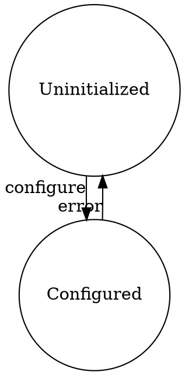

# Wiz Processor State Machine representation

```graphviz
digraph finite_state_machine {

    forcelabels=true;
	rankdir=TB;
	size="8,5";
    
	node [shape = circle];
	Uninitialized -> Configured [ xlabel = "configure" ];
	Configured -> Uninitialized  [ xlabel = "error" ];

}

```